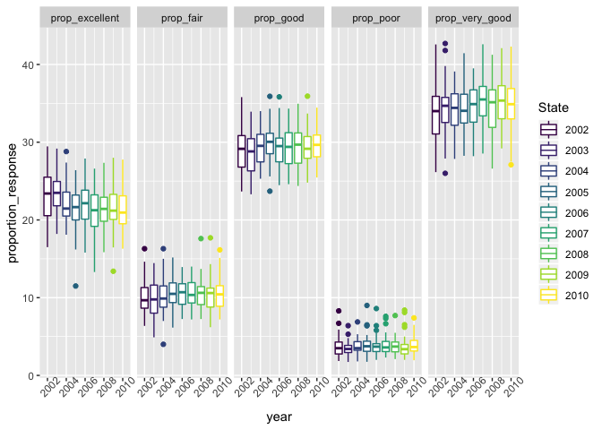
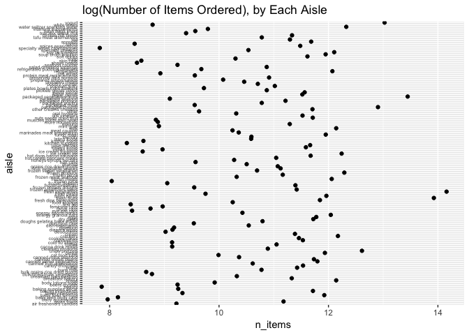
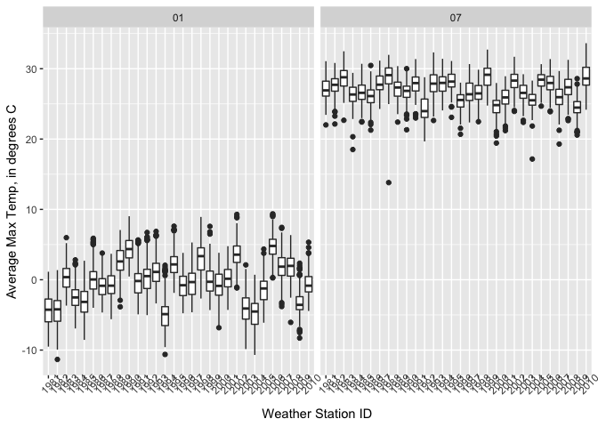
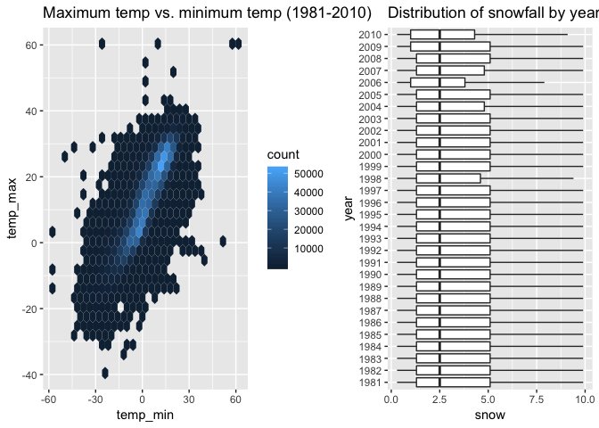

p8105\_hw3\_slb2240
================
Samantha Brown
10/7/2018

Problem 1
---------

Import and clean data:

``` r
library(p8105.datasets)
data(brfss_smart2010)

brfss_smart2010 = janitor::clean_names(brfss_smart2010) %>% 
  filter(topic == "Overall Health") %>% 
  mutate(response = as.factor(response))
```

**In 2002, which states were observed at 7 locations?**

``` r
brfss_2002 = filter(brfss_smart2010, year == "2002") %>% 
  distinct(locationabbr, locationdesc) %>% 
  count(locationabbr) %>% 
  filter(n == 7)

brfss_2002
```

    ## # A tibble: 3 x 2
    ##   locationabbr     n
    ##   <chr>        <int>
    ## 1 CT               7
    ## 2 FL               7
    ## 3 NC               7

Connecticut, Florida, and North Carolina were observed at 7 locations.

**Make a “spaghetti plot” that shows the number of locations in each state from 2002 to 2010.**

``` r
library(viridis)

brfss_2002_2010 = brfss_smart2010 %>% 
  distinct(year, locationabbr, locationdesc) %>%
  group_by(year, locationabbr) %>% 
  count(locationabbr)

ggplot(brfss_2002_2010, aes(x = year, y = n)) +
  geom_line(aes(color = locationabbr)) +
  labs(
    title = "Number of Locations in Each State, from 2002 - 2010",
    x = "Year",
    y = "Number of Locations",
    caption = "Data from brfss_smart2010"
    ) +
   viridis::scale_color_viridis(
    name = "Location",
    discrete = TRUE
    )
```


**Make a table showing, for the years 2002, 2006, and 2010, the mean and standard deviation of the proportion of “Excellent” responses across locations in NY State.**

``` r
brfss_NY = filter(brfss_smart2010, locationabbr == "NY") %>% 
  spread(key = response, value = data_value)

brfss_NY_excellent_prop = janitor::clean_names(brfss_NY) %>% 
  mutate(prop_excellent = excellent/sample_size) %>%
  group_by(year) %>% 
  summarize(mean_excellent = round(mean(prop_excellent, na.rm = TRUE), digits = 3),
            sd_excellent = round(sd(prop_excellent, na.rm = TRUE), digits = 3)) %>% 
  filter(year == c("2002", "2006", "2010"))

brfss_NY_excellent_prop
```

    ## # A tibble: 3 x 3
    ##    year mean_excellent sd_excellent
    ##   <int>          <dbl>        <dbl>
    ## 1  2002          0.300       0.0620
    ## 2  2006          0.280       0.0600
    ## 3  2010          0.211       0.0730

**For each year and state, compute the average proportion in each response category (taking the average across locations in a state). Make a five-panel plot that shows, for each response category separately, the distribution of these state-level averages over time.**

``` r
brfss_location_state_prop = brfss_smart2010 %>% 
  spread(key = response, value = data_value) %>%
  janitor::clean_names() %>%
  group_by(year, locationabbr) %>%
  summarize(prop_excellent = round(mean(excellent/sample_size, na.rm = TRUE), digits = 2),
            prop_very_good = round(mean(very_good/sample_size, na.rm = TRUE), digits = 2),
            prop_fair = round(mean(fair/sample_size, na.rm = TRUE), digits = 2),
            prop_good = round(mean(good/sample_size, na.rm = TRUE), digits = 2),
            prop_poor = round(mean(poor/sample_size, na.rm = TRUE), digits = 2)) %>% 
  rename(state = locationabbr) %>% 
  gather(key = "response", value = "proportion_response", prop_excellent:prop_poor)
  
ggplot(brfss_location_state_prop, aes(x = year, y = proportion_response, color = state)) +
  geom_line() +
  facet_grid(~response) +
  scale_color_viridis(name = "State",
    discrete = TRUE)
```



Problem 2
---------

The goal is to do some exploration of this dataset. To that end, write a short description of the dataset, noting the size and structure of the data, describing some key variables, and giving illstrative examples of observations.

``` r
data(instacart)
```

The `instacart` dataset is comprised of anonymous 2017 online grocery orders with 1384617 observations of 15 variables. Because the dataset does not draw from neither randmomized users nor purchases, the results may not accurately represent a more generalized population of Instacart users. However, for the purpose of this homework, I will analyze trends in the `instacart` dataset.

Through my data analysis I found that about 59.86% of customers reordered products. Additionally, on average, Instacart users tend to make orders every 15 days. The mean `days_since_prior_order` value is approximately 17 days, indicating that the number of days between orders is slightly positively skewed.

``` r
median(instacart$days_since_prior_order)
```

    ## [1] 15

``` r
mean(instacart$days_since_prior_order)
```

    ## [1] 17.06613

The departments in which the most items are ordered from are `produce`, `dairy eggs` and `snacks`.

``` r
most_freq_dept = instacart %>%
  select(department, add_to_cart_order) %>% 
  group_by(department) %>% 
  summarize(sum(add_to_cart_order)) %>%
  top_n(3)
```

    ## Selecting by sum(add_to_cart_order)

The graph below indicates that Sunday is the most common day of the week for instacart users to order items. This seems to make sense because many people go grocery shopping on Sundays. Mondays and Fridays are also popular days to make orders.

``` r
most_freq_dow = instacart %>% 
  select(order_dow, add_to_cart_order) %>% 
  group_by(order_dow) %>% 
  summarize(number_items = sum(add_to_cart_order)/1000)

ggplot(most_freq_dow, aes(x = order_dow, y = number_items)) +
  geom_col() +
  labs(
    title = "Items (in thousands) Ordered by Day of the Week", 
    caption = "0 denotes Sunday, 6 denotes Saturday"
  )
```


The graph below indicates that instacart users tend to make orders during the middle of the day. This result aligns with what I would expect.

``` r
most_freq_hour = instacart %>% 
  select(order_hour_of_day, add_to_cart_order) %>% 
  group_by(order_hour_of_day) %>% 
  summarize(number_items = sum(add_to_cart_order)/1000)

ggplot(most_freq_hour, aes(x = order_hour_of_day, y = number_items), xlim = (24)) +
  geom_col() +
  labs(
    title = "Items (in thousands) Ordered by Hour of the Day"
  )
```


**How many aisles are there, and which aisles are the most items ordered from?**

There are 134 aisles. The aisles in which the most items are ordered from are `fresh fruits`, `fresh vegetables`, `packaged cheese`, `packaged` `vegetables fuits`, and `yogurt`.

``` r
n_aisles = instacart %>% 
  distinct(aisle) %>% 
  nrow()

most_freq_aisle = instacart %>%
  select(aisle, add_to_cart_order) %>% 
  group_by(aisle) %>% 
  summarize(sum(add_to_cart_order)) %>%
  top_n(5)
```

    ## Selecting by sum(add_to_cart_order)

**Make a plot that shows the number of items ordered in each aisle. Order aisles sensibly, and organize your plot so others can read it.**

``` r
no_items_by_aisle = instacart %>%
  select(aisle, add_to_cart_order) %>% 
  group_by(aisle) %>% 
  summarize(n_items = sum(add_to_cart_order))

ggplot(no_items_by_aisle, aes(x = n_items, y = aisle)) +
  geom_point() +
  labs(
    title = "Number of Items Ordered in Each Aisle"
  )
```



**Make a table showing the most popular item in each of the aisles “baking ingredients”, “dog food care”, and “packaged vegetables fruits.”**

The table below shows the most popular item in each of the aisles “baking ingredients”, “dog food care”, and “packaged vegetables fruits,” by the sum of items added to cart.

``` r
popular_items = instacart %>% 
  filter(aisle == c("baking ingredients", "dog food care", "packaged vegetables fruits")) %>% 
  select(aisle, product_name, add_to_cart_order) %>% 
  group_by(aisle, product_name) %>% 
  summarize(sum(add_to_cart_order)) %>% 
  top_n(1)
```

    ## Selecting by sum(add_to_cart_order)

``` r
popular_items
```

    ## # A tibble: 3 x 3
    ## # Groups:   aisle [3]
    ##   aisle                      product_name            `sum(add_to_cart_ord…
    ##   <chr>                      <chr>                                   <int>
    ## 1 baking ingredients         Organic Vanilla Extract                  1518
    ## 2 dog food care              Sausage Cuts Real Beef…                   140
    ## 3 packaged vegetables fruits Organic Baby Spinach                    24598

**Make a table showing the mean hour of the day at which Pink Lady Apples and Coffee Ice Cream are ordered on each day of the week; format this table for human readers (i.e. produce a 2 x 7 table).**

The table below illustrates the mean hour of the day at which Pink Lady Apples and Coffee Ice Cream are ordered on each day of the week. The days range from 0 through 6, representing Sunday through Saturday, respectively. Meanwhile, the hours range from 0 through 23, representing 12:00 am through 12:00 pm, respectively. The table shows that Instacart users tend to order Pink Lady apples around noon, while users generally order coffee ice cream in the afteroon. This makes sense because I would expect that people think more about dessert in the afternoon.

``` r
apples_coffee_dow = instacart %>% 
  filter(product_name == c("Pink Lady Apples", "Coffee Ice Cream")) %>% 
  select(product_name, order_dow, order_hour_of_day) %>% 
  group_by(product_name, order_dow) %>%
  summarize(round(mean(order_hour_of_day), digits = 0)) %>% 
  rename(average_hour = "round(mean(order_hour_of_day), digits = 0)", day_of_week = order_dow) %>% 
  spread(key = day_of_week, value = average_hour)
```

    ## Warning in product_name == c("Pink Lady Apples", "Coffee Ice Cream"):
    ## longer object length is not a multiple of shorter object length

``` r
apples_coffee_dow
```

    ## # A tibble: 2 x 8
    ## # Groups:   product_name [2]
    ##   product_name       `0`   `1`   `2`   `3`   `4`   `5`   `6`
    ##   <chr>            <dbl> <dbl> <dbl> <dbl> <dbl> <dbl> <dbl>
    ## 1 Coffee Ice Cream   13.   15.   15.   15.   15.   10.   12.
    ## 2 Pink Lady Apples   12.   12.   12.   14.   12.   14.   12.

Problem 3
---------

Load in dataset:

``` r
data(ny_noaa)

ny_noaa = ny_noaa %>% 
  rename(snow_depth = snwd, temp_max = tmax, temp_min = tmin)
```

**Write a short description of the dataset, noting the size and structure of the data, describing some key variables, and indicating the extent to which missing data is an issue.**

The `ny_noaa` dataset has 2595176 observations of 7 variables. Each observation represents a New York weather station's recording of weather variables including the date in which the recording is made, precipitation (in tenths of mm), snowfall (in mm), depth of snow (in mm), maximum temperature, and minimum temperature. Maximum reported temperatures range from `min(as.numeric(ny_noaa$temp_max), na.rm = TRUE)/10` degrees Celcius to 60 degrees Celcius, while minimum reported temperatures range from `min(as.numeric(ny_noaa$temp_min), na.rm = TRUE)/10` degrees Ceclius to 60 degrees Celcius. The dataset contains missing data because each station may only record a select few of the variables. I will explore the extent to which data is missing below:

-   5.62% of precipitation data is missing.
-   14.69% of snowfall data is missing.
-   22.8% of snow depth data is missing.
-   43.71% of maximum temperature data is missing.
-   43.71% of minimum temperature data is missing.

These numbers show that an extensive proportion of the data is missing. However, for the purpose of this homework I will continue working with the dataset.

**Do some data cleaning. Create separate variables for year, month, and day. Ensure observations for temperature, precipitation, and snowfall are given in reasonable units.**

In the code chunk below, I divide the temperatures by 10 to convert temp\_max and temp\_min from tenths of degrees Celcius to degrees Celcius.

``` r
ny_noaa_dates = ny_noaa %>% 
  separate(date, c("year", "month", "day")) %>% 
  mutate(temp_max = as.numeric(temp_max)/10, temp_min = as.numeric(temp_min)/10)
```

**For snowfall, what are the most commonly observed values? Why?**

From the code chunk below we can see that the most commonly observed values are 0 mm, 13 mm, 25 mm, and 51 mm. These values convert to the metric system as approximately 0 inches, .5 inches, 1 inch, and 2 inches. These values seem to make sense because many areas of New York do not get a lot of snow.

``` r
snow_values = ny_noaa %>% 
  mutate(count = 1) %>%
  select(snow, count) %>% 
  group_by(snow) %>% 
  summarize(sum(count)) %>% 
  top_n(5)
```

    ## Selecting by sum(count)

**Make a two-panel plot showing the average max temperature in January and in July in each station across years. Is there any observable / interpretable structure? Any outliers?**

The boxplots below represent average maximum temperatures in January and July reported by each station, from 1981 to 2010. The left section, "O1", represents January temperatures, while the right section, "07", represents July temperatures. Each boxplot represents a year. For the January plots, most reported temperatures seem to range from -10˚ Celcius to 10˚ Celcius, while several outlier temperatures -- both higher and lower -- exist. Meanwhile, in looking at the July plots, the middle 50% (Q1 to Q3) of the majority of plots appear to range within 25˚ Celcius to 30˚ Celcius. It should be noted that many low-temperature outliers and only 4 high-temperature outliers exist in the July plots. Furthermore, the highest temperature in January (approximately 14˚ Celcius) reported from any station across all years appears to be approximately equal to the lowest temperature in July reported from any station across all years.

``` r
noaa_ny_jan_july = ny_noaa_dates %>% 
  filter(month == c("01", "07")) %>% 
 ## filter(temp_max != "NA") %>% 
  mutate(id_abbr = substr(id, 8, 11)) %>% 
  select(id_abbr, year, month, temp_max) %>% 
  group_by(id_abbr, year, month) %>% 
  summarize(mean_temp = round(mean(as.numeric(temp_max)), digits = 2))
  
ggplot(noaa_ny_jan_july, aes(x = year, y = mean_temp)) +
  geom_boxplot() +
  facet_grid(~month) +
  xlab("Weather Station ID") +
  ylab("Average Max Temp, in degrees C")
```

    ## Warning: Removed 5679 rows containing non-finite values (stat_boxplot).



**Make a two-panel plot showing (i) tmax vs tmin for the full dataset (note that a scatterplot may not be the best option); and (ii) make a plot showing the distribution of snowfall values greater than 0 and less than 100 separately by year.**

``` r
library(hexbin)

## Part (i)
ny_noaa_max_min = ny_noaa %>% 
  filter(temp_max != "NA", temp_min != "NA") %>% 
  mutate(temp_max = as.numeric(temp_max)/10, temp_min = as.numeric(temp_min)/10) %>% 
  select(temp_max, temp_min)

ggplot(ny_noaa_max_min, aes(x = temp_min, y = temp_max)) +
  geom_hex(na.rm = TRUE) +
  labs(
    title = "Maximum temperature vs. minimum temperature reported by NY weather stations, from 1981-2010",
    xlab = "Minimum temperature, in degrees Celcius", 
    ylab = "Maximum temperature, in degrees Celcius"
  ) +
  scale_color_viridis()
```



``` r
## Part (ii)
ny_noaa_snowfall = ny_noaa_dates %>%
  filter(snow > 0 & snow < 100) %>% 
  group_by(year)

ggplot(ny_noaa_snowfall, aes(x = year, y = snow)) +
  geom_boxplot(group = "year") +
  labs(
    title = "Distribution of snowfall by year, from 1981-2010",
    ylab = "Snowfall, in millimeters"
  )
```


